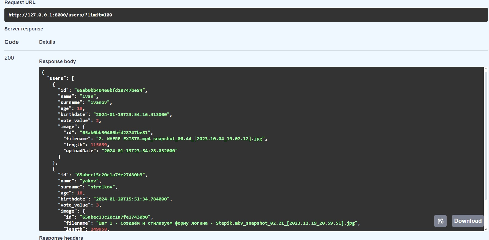
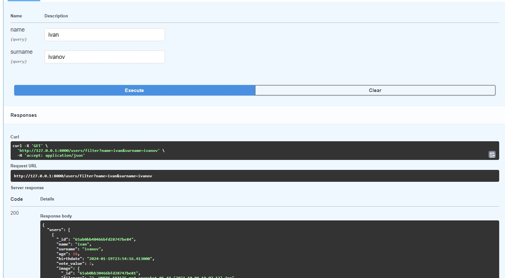
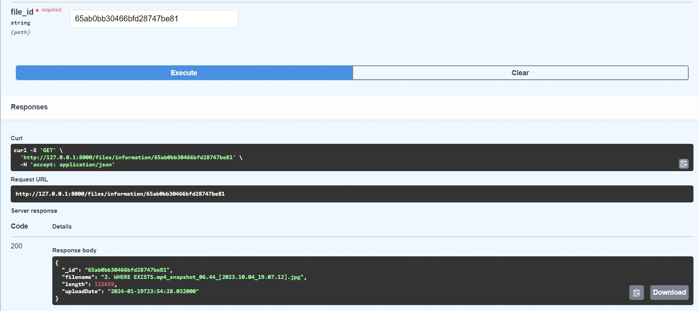
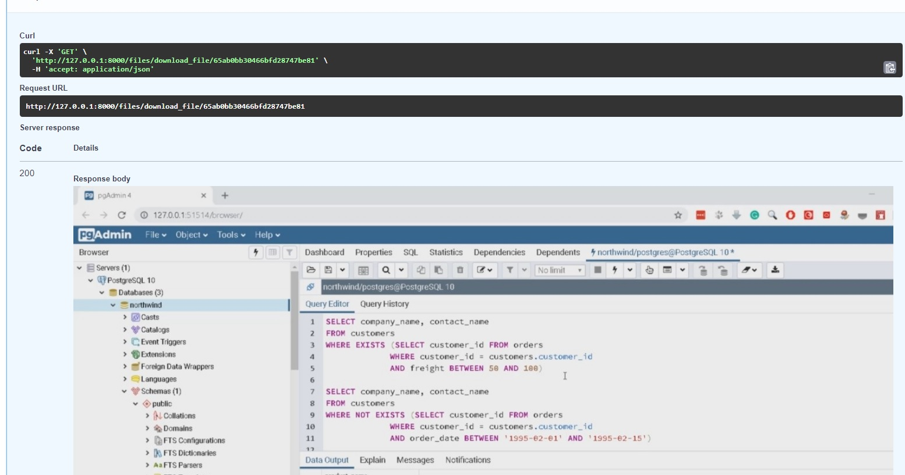

# Тестовое задания СпецВузАвтоматика

## Техническое задание
<pre>
  Проект необходимо реализовать на FastAPI, в качестве БД MongoDB. 
  Создать веб приложение, которое предоставляет REST интерфейс к базе данных клиентов компании:

  Есть возможность просмотреть список клиентов, отфильтровать пользователя по имени и фамилии, 
  в списке отсортировать по любому полю, удалить или добавить пользователя.
  В карточке пользователя (детальный просмотр) должно отображаться: имя, фамилия, возраст, дата рождения и фото.

   Реализовать выгрузку всех карточек клиентов в xlsx файл.

  Страница голосования — будут отображаться все фото пользователей и под каждым фото можно кликнуть +1. 
  Также под каждым фото виден текущий счет. 
  Если счетчик достигает 10, то за фото нельзя больше голосовать. 
  Предусмотреть, что обновление счетчика может происходить одновременно во многих процессах.
</pre>


## Запуск приложения
- Получите копию репозитория
```
https://github.com/qustoo/FastAPIHotelsEducation
```
- Заполните файл .env-non-dev переменными окружения, подмените его на .env
```
LOG_LEVEL = DEBUG/INFO
DB_TYPE = REMOTE/LOCAL

REMOTE_DB_USER = username
REMOTE_DB_PASS = password

LOCAL_DB_HOST = localhost
LOCAL_DB_PORT = 123

DB_BOX = sandbox
DB_COLLECTION = usersbox

REDIS_HOST = localhost
REDIS_PORT = 123
```
- Создайте виртуальное окружение, перейдите в него, и установите зависимости
```
make create_env
make install_depends
```
- Форматеры,линтеры и сортировка импортов: 
```
make black flake8 isort
```
- Запуск локально
```
make run
```
- Запуск через докер 
```
make up
```
- Остановка контейнера
```
make down
```
## Documentation
- Swagger IU <http://localhost:8000/docs>

## Screenshots
### All users

### Filter users by name,surname

### Details file information

### Show and download file


